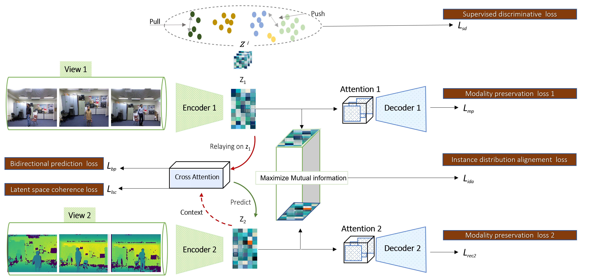

# CAIMVR: Cross-Attention for Incomplete Multi-View Representation

<p align="center">
  
  
  
</p>

<p align="center">
  <b>Official PyTorch implementation of CAIMVR</b>
</p>

---

## 📄 Abstract

**CAIMVR** (Cross-Attention for Incomplete Multi-View Representation) is a novel framework that integrates a cross-attention mechanism within an autoencoder architecture for robust multi-view representation learning under data incompleteness. The method enables dynamic inter-view information exchange through **bidirectional cross-view predictors**, allowing the model to selectively focus on available views and compensate for missing modalities.

### Key Contributions

- **Cross-Attention Mechanism**: Enables selective information exchange between views via multi-head attention
- **Bidirectional Prediction**: Recovers missing views from available modalities using cross-view predictors
- **Instance Distribution Alignment**: Enforces cross-view consistency through contrastive learning
- **Three-Phase Training Protocol**: Curriculum-based learning for stable convergence
- **Multi-Task Support**: Clustering, classification, and human action recognition

---

## 🏗️ Architecture

<p align="center">
  
</p>

### Model Components

| Component | Description | Implementation |
|-----------|-------------|----------------|
| **Autoencoder** | View-specific encoder-decoder with self-attention | `Autoencoder` class in `model.py` |
| **Cross-View Predictor** | Bidirectional predictor with cross-attention | `Prediction` class in `model.py` |
| **Attention Module** | Multi-head attention mechanism | `Attention` class in `model.py` |
| **View Encoder** | Attention-enhanced encoding layer | `EncodeView` class in `model.py` |

### Loss Functions

```
L_total = L_ida + λ₁·L_bp + λ₂·(L_mp1 + L_mp2) + L_lsc + L_sd
```

| Loss | Description |
|------|-------------|
| `L_ida` | Instance Distribution Alignment |
| `L_bp` | Bidirectional Prediction Loss |
| `L_mp` | Modality Preservation (Reconstruction) |
| `L_lsc` | Latent Space Coherence |
| `L_sd` | Supervised Discriminative Loss |

---

## 📁 Project Structure

```
CAIMVR/
├── configure/
│   ├── configure_clustering.py    # Configs for clustering tasks
│   └── configure_supervised.py    # Configs for classification/HAR tasks
├── utils/
│   ├── clustering.py              # Clustering evaluation (K-means, metrics)
│   ├── classify.py                # Classification methods (KNN, vote)
│   ├── datasets_clustering.py     # Dataset loaders for clustering
│   ├── datasets_supervised.py     # Dataset loaders for classification
│   ├── get_mask.py                # Missing view mask generation
│   ├── next_batch.py              # Batch generation utilities
│   ├── logger_.py                 # Logging configuration
│   └── util.py                    # Helper functions (normalize, metrics)
├── data/                          # Dataset files (.mat, .csv)
├── logs/                          # Training logs
├── results/                       # Experimental results
├── historiques/                   # Training history
├── model.py                       # CAIMVR model architecture
├── loss.py                        # Loss functions
├── run_clustering.py              # Clustering experiments
├── run_supervised.py              # Classification experiments
├── run_HAR.py                     # Human Action Recognition experiments
└── README.md
```

---

## ⚙️ Installation

### Requirements

- Python ≥ 3.8
- PyTorch ≥ 2.0.1
- CUDA ≥ 11.8 (recommended for GPU acceleration)

### Setup

```bash
# Clone the repository
git clone https://github.com/achrafelouahabi/CAIMVR.git
cd CAIMVR

# Create virtual environment
python -m venv venv
source venv/bin/activate  # Linux/Mac
# or: venv\Scripts\activate  # Windows

# Install dependencies
pip install -r requirements.txt
```

### Dependencies

```txt
torch>=2.0.1
numpy>=1.21.0
scipy>=1.7.0
scikit-learn>=1.0.0
einops>=0.6.0
munkres>=1.1.4
matplotlib>=3.5.0
```

---

## 📊 Datasets

### Supported Datasets

| Dataset | Task | Samples | Classes | Views | Features |
|---------|------|---------|---------|-------|----------|
| **Caltech101-20** | Clustering/Classification | 2,386 | 20 | 2 | 1984/512 |
| **Scene-15** | Clustering/Classification | 4,485 | 15 | 2 | 20/59 |
| **LandUse-21** | Clustering/Classification | 2,100 | 21 | 2 | 59/40 |
| **NoisyMNIST** | Clustering/Classification | 20,000 | 10 | 2 | 784/784 |
| **Handwritten** | Clustering/Classification | 2,000 | 10 | 2 | 240/76 |
| **MSRC-v1** | Clustering | 210 | 7 | 2 | 512/256 |
| **3Sources** | Classification | 169 | 6 | 3 | 3068/3560/3631 |
| **BBCSport** | Classification | 544 | 5 | 2 | 3183/3203 |
| **DHA** | HAR | 483 | 23 | 2 | 6144/110 |
| **UWA30** | HAR | 660 | 11 | 2 | 6144/110 |

### Data Preparation

1. Download datasets and place them in the `data/` directory
2. Ensure `.mat` files are named correctly (e.g., `Scene_15.mat`, `LandUse_21.mat`)
3. For HAR datasets, prepare `{dataset}_total_train.csv` and `{dataset}_total_test.csv`

---

## 🚀 Usage

### 1. Clustering Task

```bash
python run_clustering.py \
    --dataset 0 \
    --missing_rate 0.3 \
    --devices 0 \
    --test_time 5 \
    --print_num 50 \
    --eval_num 50
```

**Dataset IDs:**
| ID | Dataset |
|----|---------|
| 0 | Caltech101-20 |
| 1 | Scene-15 |
| 2 | NoisyMNIST |
| 3 | LandUse-21 |
| 4 | MSRC-v1 |
| 5 | Handwritten |

### 2. Classification Task

```bash
python run_supervised.py \
    --dataset 0 \
    --missing_rate 0.3 \
    --devices 0 \
    --test_time 5 \
    --print_num 50 \
    --eval_num 50
```

**Dataset IDs:**
| ID | Dataset |
|----|---------|
| 0 | Caltech101-7 |
| 1 | Scene-15 |
| 2 | NoisyMNIST |
| 3 | LandUse-21 |
| 4 | Handwritten |
| 6 | 3Sources |
| 7 | BBCSport |

### 3. Human Action Recognition (HAR)

```bash
python run_HAR.py \
    --dataset 0 \
    --devices 0 \
    --test_time 5 \
    --print_num 50 \
    --eval_num 50
```

**Dataset IDs:**
| ID | Dataset |
|----|---------|
| 0 | DHA |
| 1 | UWA30 |

### Command Line Arguments

| Argument | Description | Default |
|----------|-------------|---------|
| `--dataset` | Dataset ID (see tables above) | 0 |
| `--missing_rate` | Proportion of missing views (η) | 0.5 |
| `--devices` | GPU device ID | 0 |
| `--test_time` | Number of test runs | 5 |
| `--print_num` | Print interval (epochs) | 50 |
| `--eval_num` | Evaluation interval (epochs) | 50 |

---

## ⚡ Configuration

Hyperparameters are defined in `configure/configure_clustering.py` and `configure/configure_supervised.py`.

### Example Configuration (Caltech101-20)

```python
config = dict(
    seed=4,
    view=2,
    training=dict(
        pretrain_epochs=150,
        batch_size=256,
        epoch=300,
        alpha=10,           # Contrastive alignment strength
        lambda1=0.11,       # Prediction loss weight
        lambda2=0.1,        # Reconstruction loss weight
        lr=1.0e-4,
    ),
    Autoencoder=dict(
        arch1=[1984, 1024, 1024, 1024, 128],  # View 1 architecture
        arch2=[512, 1024, 1024, 1024, 128],   # View 2 architecture
        activations1='gelu',
        activations2='gelu',
        batchnorm=True,
        heads=16            # Number of attention heads
    ),
    Prediction=dict(
        arch1=[128, 256, 128],
        arch2=[128, 256, 128],
        activations1='gelu',
        activations2='gelu',
        heads=8
    )
)
```

### Key Hyperparameters

| Parameter | Description | Recommended Range |
|-----------|-------------|-------------------|
| `alpha` | Instance alignment strength | 10 |
| `lambda1` | Prediction loss weight | 0.1 - 0.11 |
| `lambda2` | Reconstruction loss weight | 0.1 |
| `heads` | Number of attention heads | 1 - 16 |
| `lr` | Learning rate | 1e-4 - 5e-4 |

---

## 📈 Experimental Results

### Clustering Performance (η = 0.3)

| Dataset | ACC | NMI | ARI |
|---------|-----|-----|-----|
| Handwritten | 88.42 ± 0.5 | 83.32 ± 0.4 | 79.52 ± 0.6 |
| Scene-15 | 41.31 ± 1.2 | 43.01 ± 0.8 | 25.32 ± 1.1 |
| LandUse-21 | 29.42 ± 1.5 | 33.13 ± 1.0 | 15.54 ± 1.3 |
| NoisyMNIST | 97.01 ± 0.3 | 94.01 ± 0.2 | 94.12 ± 0.4 |

### Classification Performance (η = 0.3)

| Dataset | ACC | Precision | F1-Score | AUC |
|---------|-----|-----------|----------|-----|
| Caltech101-7 | 98.51 ± 0.46 | 93.20 ± 2.40 | 97.60 ± 0.49 | - |
| Handwritten | 98.60 ± 0.56 | 98.40 ± 0.49 | 99.40 ± 0.49 | - |
| BBCSport | 97.43 ± 2.49 | 97.40 ± 2.80 | 98.40 ± 1.74 | - |

### Human Action Recognition

| Dataset | RGB | Depth | RGB+Depth |
|---------|-----|-------|-----------|
| UWA30 | 78.82 | 49.06 | **79.45** |
| DHA | 79.33 | 80.99 | **92.56** |

---

## 🔬 Training Protocol

CAIMVR employs a **three-phase training protocol**:

### Phase 1: Reconstruction Pre-training
- Train autoencoders on complete-view samples
- Optimize: `L_ida + λ₂·(L_mp1 + L_mp2)`

### Phase 2: Joint Fine-tuning
- Activate cross-view predictors
- End-to-end optimization with all losses
- Optimize: `L_ida + λ₁·L_bp + λ₂·(L_mp1 + L_mp2) + L_lsc`

### Phase 3: Predictor Specialization (Optional)
- Freeze autoencoders
- Train predictors with artificially masked data

---

## 📝 Citation

If you find this work useful, please cite:

```bibtex
@article{elouahabi2025caimvr,
  title={Cross-attention mechanism for robust representation learning in incomplete multi-view datasets},
  author={El Ouahabi, Achraf and Benaddy, Mohamed and Hadri, Aissam},
  journal={[Journal Name]},
  year={2025},
  institution={Ibnou Zohr University, Agadir, Morocco}
}
```

---

## 👥 Authors

| Author | Affiliation | Email |
|--------|-------------|-------|
| **Achraf El Ouahabi** ✉️ | LAB SI, Ibnou Zohr University | achraf.elouahabi@edu.uiz.ac.ma |
| Mohamed Benaddy | LAB SI, Ibnou Zohr University | - |
| Aissam Hadri | LAB SIV, Ibnou Zohr University | - |

---

## 🙏 Acknowledgments

This research was conducted at **Ibnou Zohr University**, Agadir, Morocco.

**Computational Resources:**
- Google Colab with NVIDIA Tesla T4 GPU (16GB VRAM)
- NVIDIA A100 GPU (40GB VRAM) for large-scale experiments

---

## 📜 License

This project is licensed under the MIT License - see the [LICENSE](LICENSE) file for details.

---

## 📚 Related Resources

- [Datasets Repository](https://github.com/achrafelouahabi/DM/)
- [Paper (Coming Soon)](#)

---

<p align="center">
  <b>⭐ If you find this repository helpful, please consider giving it a star! ⭐</b>
</p>
